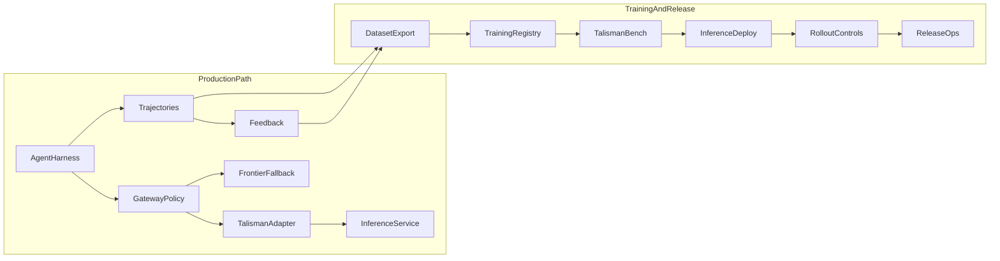

# Talisman Owned Agent Model Program

`TL-84` defines the proprietary agent-model delivery program. `TL-97` owns this living architecture and operations guide, the documentation impact matrix, and the final consistency audit required before the parent program can close.

Every child issue under `TL-84` must update its affected runbooks, ADRs, schemas, and configuration references in the same change. This guide is the canonical index; issue-owned runbooks remain the detailed operating surface.

## System architecture

```text
Agent harness (Stan)
  -> LLM gateway / provider settings (api/llm_settings.py)
  -> talisman OpenAI-compatible adapter (talisman_openai_compat.py)
  -> governed inference endpoint (TL-95)
  -> frontier-provider fallback (TL-92)

Production trajectories + human feedback (TL-87, TL-88)
  -> governed dataset export (TL-90)
  -> SFT / preference training + registry (TL-91, TL-93)
  -> TalismanBench release gate (TL-89)
  -> inference deploy + readiness (TL-95)
  -> shadow / canary rollout (TL-92)
  -> release refresh + retirement (TL-96)

Offline evaluation and research
  -> replay environments + process rewards (TL-94)
  -> offline policy experiments (TL-68)
```



## Trust boundaries

| Boundary | Owner | Rule |
| --- | --- | --- |
| Raw trajectory payloads | `TL-87` | Restricted operational data; not a training export |
| Sanitized training views | `TL-87` / `TL-90` | Only exportable view; redaction manifest required |
| Human-reviewed labels | `TL-88` | Distinct from inferred signals; explicit training consent |
| Model egress | ADR-006 + gateway policy | External frontier calls follow existing egress rules |
| Owned-model inference | `TL-86` / `TL-95` | Self-hosted endpoint; configured via `TALISMAN_*` only |
| Deterministic gates | Policy / quality contracts | Non-overridable by owned model or offline experiments |
| Release promotion | `TL-91` / `TL-96` | Human approval required; no autonomous production promotion |

When routing to the owned model, deterministic policy, source-quality, approval, and DecisionQuality gates remain authoritative. Fallback to the frontier baseline is automatic for endpoint failures, low confidence, unsupported tasks, lifecycle disablement, and rollout kill-switch activation.

## Eight-stage release workflow

Canonical operator sequence (each stage below promotion can use `--dry-run`):

| Stage | Issue | Primary runbook | Output |
| --- | --- | --- | --- |
| 1 Dataset export | `TL-90` | [talisman_training_datasets.md](talisman_training_datasets.md) | `outputs/agent_training_datasets/<version>/` |
| 2 Train + register | `TL-91` / `TL-93` | [talisman_agent_model_training.md](talisman_agent_model_training.md) | `outputs/agent_model_training/`, registry entry |
| 3 Release gate | `TL-89` | [talisman_bench/README.md](talisman_bench/README.md) | `outputs/talisman_bench/<timestamp>/release_report.json` |
| 4 Human approval | `TL-96` | [talisman_model_release_operations.md](talisman_model_release_operations.md) | `outputs/model_release_ops/release_records/` |
| 5 Promote candidate | `TL-91` | [talisman_agent_model_training.md](talisman_agent_model_training.md) | Registry lifecycle `approved` |
| 6 Inference deploy | `TL-95` | [talisman_inference_service.md](talisman_inference_service.md) | `outputs/inference_deployments/<env>/` |
| 7 Shadow + canary | `TL-92` | [talisman_owned_model_rollout.md](talisman_owned_model_rollout.md) | Trajectory + SSE rollout telemetry |
| 8 Monitoring + refresh | `TL-96` | [talisman_model_release_operations.md](talisman_model_release_operations.md) | Dry-run reports, drift alerts |

## First-party provider contract (`TL-86`)

The `talisman` provider connects the agent harness to any OpenAI-compatible endpoint without changing frontend or tool contracts.

| Capability | Module | Configuration |
| --- | --- | --- |
| Chat completions (text, streaming) | `talisman_openai_compat.py` | `TALISMAN_BASE_URL`, `TALISMAN_API_KEY` |
| Tool calling + structured JSON | `talisman_openai_compat.py` | Tier aliases `TALISMAN_MODEL_{LOW,MID,HIGH}` |
| Gateway lifecycle policy | `api/llm_settings.py` | `provider_lifecycle.talisman`, model lifecycle |
| Egress governance | `api/agent_governance.py` | Provider allowlist and local-only rules |

Application code never depends on host-specific control APIs. Base model and serving stack selections are versioned deployment decisions documented in ADR-010 and the candidate matrix.

## Registry lifecycle states

Committed registry: `data/agent_model_candidates/registry.json`

| State | Routing | Promotion / deploy | Audit retention |
| --- | --- | --- | --- |
| `candidate` | Not routed | Trained artifact with manifest and model card | Full |
| `approved` | Eligible when referenced by rollout policy | May be promoted and deployed | Full |
| `deprecated` | Not routed | Superseded but retained for replay | Full |
| `disabled` | Blocked | Blocked from promotion, deploy, and rollout | Full |

`retire` and `disable` stop routing but **do not** delete cloud artifacts, model cards, bench reports, or release records. Operators must follow the serving cleanup checklist for inference scale-down and secret rotation.

## Rollout and fallback (`TL-92`)

Persisted rollout policy lives in `gateway_policy.owned_model_rollout` (see [talisman_owned_model_rollout.md](talisman_owned_model_rollout.md)). Emergency break-glass overrides are env-only.

Complete fallback reason taxonomy (from `api/owned_model_rollout.py`):

- `rollout_disabled`
- `kill_switch_active`
- `force_baseline_active`
- `task_class_not_eligible`
- `candidate_not_approved`
- `candidate_lifecycle_disabled`
- `candidate_unavailable`
- `provider_lifecycle_disabled`
- `model_lifecycle_disabled`
- `confidence_below_threshold`
- `unsupported_capability`
- `endpoint_failure`
- `endpoint_timeout`
- `malformed_output`
- `schema_failure`
- `policy_denied`
- `gate_failure`
- `canary_not_selected`

## Monitoring surfaces

There is no dedicated owned-model dashboard in the current slice. Operators aggregate from:

- SSE events: `owned_model_rollout`, `done.owned_model_rollout.reporting`, `done.owned_model_rollout.telemetry.shadow_comparison`
- Trajectory field: `raw_payload.owned_model_rollout`
- Human feedback failure tags
- Registry lifecycle and TalismanBench evidence
- Release-ops dry-run reports (`outputs/model_release_ops/`)
- Inference log-based metrics via `infra/gcp/setup-inference-monitoring.sh`

## Privacy, retention, and deletion

| Artifact | Retention class | Deletion behavior |
| --- | --- | --- |
| Raw trajectories | `agent_trajectory_365d` | Tombstone preserves audit lineage; training export blocked |
| Sanitized training views | `agent_training_view_365d` | Updated on tombstone; excluded from export |
| Human feedback | Cascades on trajectory tombstone | Excluded from export when tombstoned |
| Model artifacts / cards | Indefinite for audit | `retire` / `disable` stops routing only |
| Bench reports / release records | Indefinite for audit | Immutable decision records |

Training exports enforce leakage checks, release-gate case exclusion, and redaction manifest validation. See [talisman_trajectories.md](talisman_trajectories.md) and [talisman_training_datasets.md](talisman_training_datasets.md).

## Canonical rollback drill

Use this sequence for production incidents. Record a `rollback` decision through release ops when possible.

1. Set `AGENT_OWNED_MODEL_ROLLOUT_KILL_SWITCH=true` **or** gateway `owned_model_rollout.enabled=false` with required `gateway_note`.
2. Optionally set `AGENT_OWNED_MODEL_FORCE_BASELINE=true` to keep telemetry while forcing baseline responses.
3. Disable the candidate in the registry (`disable` or `retire`).
4. Set `provider_lifecycle.talisman=disabled` or model lifecycle to `disabled` for the served alias.
5. Rotate `TALISMAN_BASE_URL` to prior secret version or scale inference service to zero.
6. Verify frontier baseline restoration, explicit fallback reason emission, and unchanged deterministic gates.

Issue-specific details: [talisman_owned_model_rollout.md](talisman_owned_model_rollout.md), [talisman_inference_service.md](talisman_inference_service.md), [talisman_model_release_operations.md](talisman_model_release_operations.md).

## Environment variables index

| Variable | Default | Purpose | Documented in |
| --- | --- | --- | --- |
| `TALISMAN_BASE_URL` | — | OpenAI-compatible endpoint | `.env.example`, inference runbook |
| `TALISMAN_API_KEY` | — | Endpoint authentication | `.env.example` |
| `TALISMAN_MODEL_{LOW,MID,HIGH}` | tier aliases | Model routing | `.env.example` |
| `TALISMAN_TIMEOUT_S` | `120` | Request timeout | `.env.example` |
| `TALISMAN_INFERENCE_SMOKE` | unset | Live contract test gate | inference runbook |
| `TALISMAN_BENCH_CANDIDATE_*` | — | Manual bench against endpoint | bench README |
| `AGENT_OWNED_MODEL_ROLLOUT_KILL_SWITCH` | `false` | Emergency rollout disable | rollout runbook |
| `AGENT_OWNED_MODEL_FORCE_BASELINE` | `false` | Force baseline with telemetry | rollout runbook |
| `AGENT_OWNED_MODEL_SHADOW_MODE` | unset | Env override for shadow | rollout runbook |
| `AGENT_OWNED_MODEL_CANARY_ENABLED` | unset | Env override for canary | rollout runbook |
| `AGENT_MODEL_RELEASE_FALLBACK_RATE_THRESHOLD` | `0.15` | Refresh trigger | release-ops runbook |
| `AGENT_MODEL_RELEASE_GATE_FAILURE_THRESHOLD` | `3` | Refresh trigger | release-ops runbook |
| `AGENT_MODEL_RELEASE_REVIEWED_FEEDBACK_THRESHOLD` | `5` | Refresh trigger | release-ops runbook |
| `SCHEDULE_AGENT_MODEL_RELEASE_REFRESH` | `0` | Opt-in weekly scheduler job | `infra/gcp/setup-scheduler.sh` |
| `INFERENCE_ALLOW_SERVE` | unset | Governed vLLM startup gate | inference runbook |

## Documentation impact matrix

Audit status reflects the `TL-97` final pass on 2026-06-12.

| Issue | Primary runbook | ADR(s) | Key modules | Test targets | Audit |
| --- | --- | --- | --- | --- | --- |
| `TL-89` | [talisman_bench/README.md](talisman_bench/README.md) | [010](adr/010-open-weight-base-model-and-inference-host.md) | `decision_quality/talisman_bench.py` | `test_talisman_bench.py`, `test_bench_openai_client.py` | Pass |
| `TL-85` | [talisman_bench/README.md](talisman_bench/README.md) | [010](adr/010-open-weight-base-model-and-inference-host.md) | `docs/talisman_bench/candidate_matrix.json` | `test_talisman_bench.py` | Pass |
| `TL-86` | **This guide § First-party provider** | — (provider contract; no separate ADR) | `talisman_openai_compat.py`, `api/llm_settings.py` | `test_talisman_provider.py`, `test_llm_settings.py` | Pass |
| `TL-87` | [talisman_trajectories.md](talisman_trajectories.md) | — | `api/agent_trajectories.py` | `test_agent_trajectories.py` | Pass |
| `TL-88` | [talisman_trajectories.md](talisman_trajectories.md) § Human Feedback | — | `api/agent_response_feedback.py` | `test_agent_response_feedback.py` | Pass |
| `TL-90` | [talisman_training_datasets.md](talisman_training_datasets.md) | — | `decision_quality/agent_training_datasets.py` | `test_agent_training_datasets.py` | Pass |
| `TL-91` | [talisman_agent_model_training.md](talisman_agent_model_training.md) | [011](adr/011-agent-model-training-registry.md) | `decision_quality/agent_model_training.py` | `test_agent_model_training.py` | Pass |
| `TL-93` | [talisman_agent_model_training.md](talisman_agent_model_training.md) | [012](adr/012-preference-optimization-training.md) | `decision_quality/agent_model_training.py` | `test_agent_preference_training.py` | Pass |
| `TL-95` | [talisman_inference_service.md](talisman_inference_service.md) | [010](adr/010-open-weight-base-model-and-inference-host.md) | `agent_inference_deployment.py`, `inference_readiness.py` | `test_agent_inference_deployment.py`, `test_inference_readiness.py`, `test_inference_deploy_scripts.py` | Pass |
| `TL-92` | [talisman_owned_model_rollout.md](talisman_owned_model_rollout.md) | [013](adr/013-owned-model-rollout-controls.md) | `api/owned_model_rollout.py`, `api/routers/agent.py` | `test_owned_model_rollout.py`, `test_agent_owned_model_rollout.py` | Pass |
| `TL-94` | [talisman_agent_replay_environments.md](talisman_agent_replay_environments.md) | — | `decision_quality/agent_replay_environments.py` | `test_agent_replay_environments.py` | Pass |
| `TL-68` | [talisman_offline_policy_experiments.md](talisman_offline_policy_experiments.md) | [014](adr/014-offline-agent-policy-experiments.md) | `decision_quality/agent_policy_experiments.py` | `test_agent_policy_experiments.py` | Pass |
| `TL-96` | [talisman_model_release_operations.md](talisman_model_release_operations.md) | [015](adr/015-model-release-operations.md) | `decision_quality/agent_model_release_ops.py`, `api/maintenance_jobs.py` | `test_agent_model_release_ops.py`, `test_async_jobs.py`, `test_admin_jobs_security.py` | Pass |
| `TL-97` | **This guide** | All ADRs 010–015 | Cross-doc index | Full program bundle (below) | Pass |

## ADR index

| ADR | Status | Issue | Topic |
| --- | --- | --- | --- |
| [010](adr/010-open-weight-base-model-and-inference-host.md) | Accepted | `TL-85`, `TL-95` | Base model and inference host selection |
| [011](adr/011-agent-model-training-registry.md) | Accepted | `TL-91` | SFT training and candidate registry |
| [012](adr/012-preference-optimization-training.md) | Accepted | `TL-93` | Preference optimization from reviewed pairs |
| [013](adr/013-owned-model-rollout-controls.md) | Accepted | `TL-92` | Shadow, canary, fallback, rollback |
| [014](adr/014-offline-agent-policy-experiments.md) | Accepted | `TL-68` | Offline contextual-bandit experiments |
| [015](adr/015-model-release-operations.md) | Accepted | `TL-96` | Release refresh, monitoring, retirement |

ADR-006 (external provider egress) remains the cross-cutting privacy boundary for frontier calls and is referenced where owned-model routing coexists with external providers.

## Verification command bundle

Consolidated CI-safe program tests:

```bash
pytest tests/test_agent_training_datasets.py tests/test_agent_model_training.py \
  tests/test_agent_preference_training.py tests/test_talisman_bench.py \
  tests/test_bench_openai_client.py tests/test_agent_inference_deployment.py \
  tests/test_inference_readiness.py tests/test_inference_deploy_scripts.py \
  tests/test_talisman_provider.py tests/test_llm_settings.py \
  tests/test_owned_model_rollout.py tests/test_agent_owned_model_rollout.py \
  tests/test_agent_governance.py tests/test_agent_model_release_ops.py \
  tests/test_async_jobs.py tests/test_admin_jobs_security.py -q
```

Non-mutating operator CLI checks:

```bash
python -m decision_quality.agent_training_datasets export --dry-run
python -m decision_quality.talisman_bench \
  --manifest docs/talisman_bench/manifest.json --approved-only --dry-run
python -m decision_quality.agent_model_release_ops dry-run \
  --registry data/agent_model_candidates/registry.json --candidate-id <id>
python -m decision_quality.agent_inference_deployment validate --candidate-id <id>
python -m decision_quality.inference_readiness startup-check \
  --deployment-manifest outputs/inference_deployments/nonprod/<id>.json \
  --registry data/agent_model_candidates/registry.json
```

Documentation consistency sweeps:

```bash
rg 'TL-97|cross-cutting architecture|AGENT_MODEL_RELEASE_|owned_model_rollout' \
  docs/ .env.example infra/gcp api decision_quality
```

## Final audit record

**Audit date:** 2026-06-12  
**Auditor:** `TL-97` implementation pass  
**Result:** Pass — documentation impact matrix complete; known limitations recorded below.

### Resolved in this audit

- Created canonical program guide with lifecycle, trust boundaries, and operator index.
- Completed documentation impact matrix for all `TL-84` child issues including reused `TL-68`.
- Normalized complete fallback reason taxonomy in rollout runbook.
- Added TL-86 provider operating surface (previously undocumented as standalone runbook).
- Linked trajectories doc to owned-model rollout telemetry.
- Updated `.env.example` with release-ops threshold variables.
- Updated `infra/gcp/README.md` with release-refresh scheduler opt-in.
- Harmonized ADR statuses 010–014 to Accepted where implementation is complete.

### Known limitations (explicit, not blockers)

- No dedicated owned-model operator dashboard; monitoring remains trajectory/SSE/log based.
- `retire` / `disable` do not auto-delete Cloud Run services, GCS artifacts, or Secret Manager versions.
- ADR-006 egress guidance is not duplicated here; frontier routing follows existing gateway policy.
- Live inference smoke tests require `TALISMAN_INFERENCE_SMOKE=1` and a reachable endpoint.

### Documentation owners

| Area | Owner issue | Primary runbook |
| --- | --- | --- |
| Program index | `TL-97` | This guide |
| Release gate / matrix | `TL-89` / `TL-85` | TalismanBench README |
| Provider adapter | `TL-86` | This guide § First-party provider |
| Trajectories / feedback | `TL-87` / `TL-88` | Trajectories doc |
| Datasets | `TL-90` | Training datasets doc |
| Training / registry | `TL-91` / `TL-93` | Agent model training doc |
| Inference service | `TL-95` | Inference service doc |
| Rollout controls | `TL-92` | Owned-model rollout doc |
| Release operations | `TL-96` | Model release operations doc |
| Replay environments | `TL-94` | Replay environments doc |
| Offline policy experiments | `TL-68` | Offline policy experiments doc |
